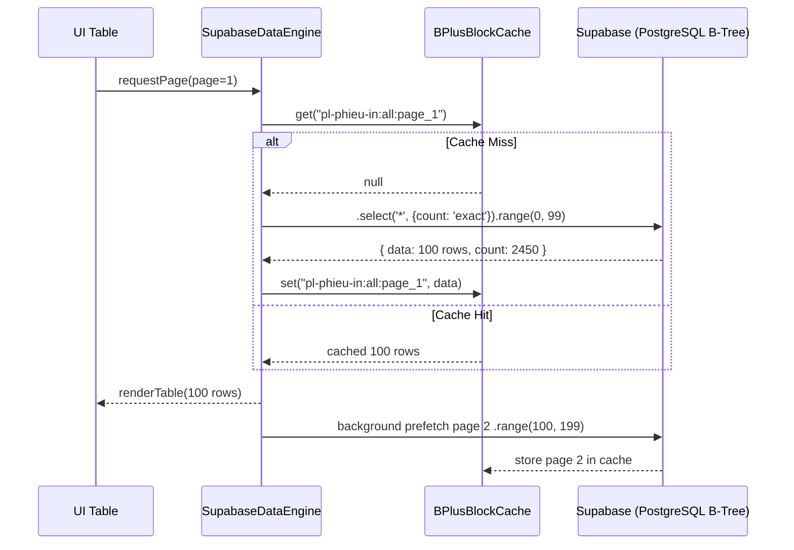

# Design Spec: Server-side B+ Tree Cursor Pagination & Block Cache

## 1. Overview & Objectives

Existing data pages fetch the entire dataset at startup and paginate client-side in RAM. While functional for small datasets, this causes initial page load delays as data volume grows.

This spec introduces a **Server-side B+ Tree Range Pagination engine with Client Block Caching & Intelligent Pre-fetching**.

### Key Objectives
- **Sub-50ms Initial Load**: Fetch only the first 100 rows (`range(0, 99)`) + total count on startup.
- **Instant Page Navigation**: Zero-delay ($0\text{ ms}$) page transitions using a client-side Block Cache (`BPlusBlockCache`) and idle-time pre-fetching of page $N+1$.
- **Seamless Filtering & Search**: Apply server-side filters on Supabase with indexed B-Tree range queries.
- **Cache Invalidation Safety**: Automatically invalidate affected blocks on Insert/Update/Delete operations.

---

## 2. Architecture & Component Design

```
+-----------------------------------------------------------------------+
|                              UI Table                                 |
+-----------------------------------------------------------------------+
                                   |
                                   v
+-----------------------------------------------------------------------+
|                        DataEngine (Manager)                           |
+-----------------------------------------------------------------------+
            /                              \
           v                                v
+-----------------------+       +---------------------------------------+
|  BPlusBlockCache      |       |  Supabase Client                      |
|  (In-Memory Page Map) |       |  (PostgreSQL B-Tree Index Query)       |
+-----------------------+       +---------------------------------------+
```

### 2.1 Component Responsibilities

1. **`SupabaseDataEngine`**:
   - Manages state for table name, current page, rows per page (default: 100), active filters, and search terms.
   - Computes a unique `filterHash` from the active query state (`search`, `fromDate`, `toDate`, `filterDropdowns`).
   - Executes range queries against Supabase using `.range(start, end)` with `.select('*', { count: 'exact' })`.

2. **`BPlusBlockCache`**:
   - Stores fetched page blocks indexed by `cacheKey = `${tableName}:${filterHash}:page_${page}``.
   - Implements a Block-based Map with Maximum Capacity (LRU replacement, default: 50 pages).
   - Holds page metadata (total count, total pages, timestamp).

3. **Intelligent Pre-fetcher**:
   - When Page $N$ finishes rendering, fires a background asynchronous fetch for Page $N+1$ (if $N < \text{totalPages}$).
   - Pre-fetched data is stored directly in `BPlusBlockCache` without blocking the UI thread.

4. **Cache Invalidation Service**:
   - On Insert, Update, or Delete:
     - Clears cache blocks for the affected table.
     - Reloads the active page immediately.

---

## 3. Data Flow & Sequence

### 3.1 Initial Page Load / Page Change
1. UI requests Page $N$ for table `T` with `filterHash`.
2. `SupabaseDataEngine` checks `BPlusBlockCache.get(cacheKey)`.
3. **Cache Hit**:
   - Return page data immediately ($0\text{ ms}$).
   - Render table rows.
4. **Cache Miss**:
   - Show minimal loading spinner.
   - Fetch range `[(N-1)*100, N*100 - 1]` from Supabase.
   - Store result in `BPlusBlockCache`.
   - Render table rows.
5. **Post-render Pre-fetch**:
   - If Page $N+1$ exists and is not in cache, fetch Page $N+1$ silently in the background.



---

## 4. Error Handling & Edge Cases

- **Network Failures**: If Supabase query fails, retain previous cached data if available and display a non-blocking toast alert with a "Retry" button.
- **Empty Filter Results**: Gracefully cache empty result blocks (`count = 0`) to prevent repeated empty queries.
- **Stale Cache Prevention**: Every cache entry has a TTL (Time-To-Live, default: 5 minutes). Expired entries trigger fresh background revalidation.

---

## 5. Scope & Target Files

The module will be implemented as a reusable core service in `assets/js/supabase-data-engine.js` and integrated across:
- `assets/js/pl/pl-phieu-in.js`
- `assets/js/tole/tole-nhap-supabase.js`
- `assets/js/tole/tole-xuat-supabase.js`
- `assets/js/tole/tole-ton-supabase.js`
- `assets/js/xg/xg-nhap-supabase.js`
- `assets/js/xg/xg-xuat-supabase.js`
- `assets/js/xg/xg-ton-supabase.js`
- All corresponding files in `dist-app/assets/js/`.
