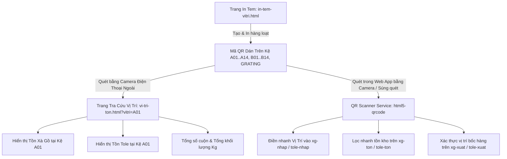

# Thiết Kế Hệ Thống Mã QR Vị Trí Kệ Kho (A01-A14, B01-B14 & Grating) & Bộ Giải Mã Thông Minh

**Ngày tạo:** 2026-08-26  
**Dự án:** Hệ thống Quản lý Kho Thép Đại Dũng (DDC)  
**Phạm vi áp dụng:** Kho Xà gồ (`xg-ton`), Kho Tole (`tole-ton`), Kho Phụ liệu và các phân hệ Nhập / Xuất kho.

---

## 1. Tổng Quan & Mục Tiêu

### 1.1. Hiện trạng & Bối cảnh
* Mặt bằng kho thực tế hiện sử dụng chung cho cả hai kho **Xà gồ** và **Tole**, gồm:
  - **28 Kệ chuẩn:** Dãy A (`A01` đến `A14`) và Dãy B (`B01` đến `B14`).
  - **Khu vực Kệ Grating:** `GRATING` (và các phân khu grating mở rộng như `GR-01`, `GR-02`).
* Hiện tại các thao tác nhập vị trí khi Nhập/Xuất kho hoặc tìm kiếm tồn kho đều thực hiện thủ công bằng cách gõ tay, dễ gây sai sót chính tả và mất thời gian khi kiểm kê thực tế tại xưởng.

### 1.2. Mục tiêu giải pháp
1. **Trang Tạo & In Tem QR Công Nghiệp (`pages/in-tem-vitri.html`):** Cho phép thủ kho xem trước và in ấn hàng loạt tem dán kệ khổ A4 (2 hoặc 4 tem/trang) và khổ Decal nhiệt (100x75mm / 100x150mm), chứa Logo DDC, Tên kệ chữ lớn tương phản cao, Mã QR chuẩn nét và Mã vạch Code 128.
2. **Cơ chế QR Payload Thông minh (Smart Dual-Purpose):**
   - **Quét bằng Camera ngoài (Zalo / iPhone / Android):** Tự động mở trang web tra cứu tổng hợp tồn kho tại vị trí đó (`pages/vi-tri-ton.html?vitri=A01`), hiển thị cả cuộn Xà gồ và Tole đang nằm trên kệ kèm tổng kg.
   - **Quét bên trong Web App (Camera Scanner & Súng bắn mã vạch):** Tự động bóc tách mã kệ sạch (`A01`, `B02`, `GRATING`) để điền tức thì vào các trường `Vị trí` trong bảng Nhập/Xuất hoặc lọc nhanh bảng Tồn.
3. **Module Quét Camera Trực Tiếp (`qr-scanner-service.js`):** Tích hợp nút quét camera trên các màn hình `xg-ton`, `tole-ton`, `xg-nhap`, `tole-nhap`, `xg-xuat`, `tole-xuat`.
4. **Hỗ trợ Deep-link tham số URL:** Khi truy cập trang có query `?vitri=A01`, giao diện tự động lọc bảng theo vị trí đó.

---

## 2. Kiến Trúc Hệ Thống & Các Thành Phần



---

## 3. Thiết Kế Chi Tiết Từng Thành Phần

### 3.1. Trang In Tem QR Vị Trí (`pages/in-tem-vitri.html`)

#### Giao diện điều khiển (Control Panel):
* **Chọn phạm vi kệ:**
  - Checkbox Dãy A (`A01` - `A14`)
  - Checkbox Dãy B (`B01` - `B14`)
  - Checkbox Kệ Grating (`GRATING`, `GR-01`, `GR-02`)
  - Các nút thao tác nhanh: *[Chọn tất cả]*, *[Bỏ chọn]*, *[Chọn riêng Dãy A]*, *[Chọn riêng Dãy B]*.
  - Ô nhập thêm vị trí tùy chỉnh (ngăn cách bằng dấu phẩy).
* **Tùy chọn hiển thị & Kích cỡ in:**
  - **Khổ A4 - 2 tem/trang (Rất lớn, dán đầu dãy kệ):** Kích thước ~ 180x120mm.
  - **Khổ A4 - 4 tem/trang (Lớn, dán từng ngăn kệ):** Kích thước ~ 130x90mm.
  - **Khổ Tem Decal 100x75mm / 100x150mm:** Tương thích máy in nhiệt XP-420B / Gprinter.
* **Cấu hình nhãn:**
  - Tiêu đề nhãn: *"KHO XÀ GỒ & TOLE - NHÀ MÁY DDC"*
  - Domain nhúng vào QR: Tự động nhận diện domain hiện tại (`window.location.origin`) hoặc cho phép tùy chỉnh.

#### Thiết kế mẫu Tem In (Industrial Aesthetic Label):
* **Viền tem:** Khung bo góc công nghiệp, độ dày nét 2px chống nhòe khi in laser/nhiệt.
* **Header:** Logo Thép Đại Dũng DDC (vector SVG/PNG nét cao) + Tên phân xưởng.
* **Khu vực trung tâm:**
  - Tên Kệ in **Font Bold Sans-Serif siêu lớn** (ví dụ: **A01**, **B14**, **GRATING**).
  - Khối mã **QR Code** kích thước chuẩn, độ tương phản tuyệt đối (Black on White) với mức sửa sai ECC Level M/Q.
* **Khu vực phụ:**
  - Mã vạch **Barcode Code 128** kèm text phụ bên dưới.
  - Dòng hướng dẫn: *"Quét mã QR để tra cứu tồn kho hoặc quét khi Nhập / Xuất"*.
* **Tối ưu In Ấn (`@media print`):**
  - Tự động ẩn toàn bộ header, sidebar và thanh công cụ.
  - Tự động căn lề chuẩn, sử dụng `break-inside: avoid; page-break-after: auto;` để tem không bị cắt ngang giữa trang.
  - Phím tắt nhanh: `Ctrl + P` hoặc nút **[🖨️ In Danh Sách Tem]**.

---

### 3.2. Trang Tra Cứu Tồn Kho Theo Vị Trí Kệ (`pages/vi-tri-ton.html`)

Trang tra cứu độc lập, được thiết kế tối ưu hiển thị trên màn hình điện thoại (Mobile-First) khi công nhân quét mã QR tại xưởng:

1. **Nhận diện tham số URL:**
   - Đọc query param `?vitri=A01` (hoặc vị trí tương ứng).
   - Nếu không có tham số, hiển thị thanh tìm kiếm / danh sách chọn nhanh 28 kệ.
2. **Tổng hợp dữ liệu từ Supabase:**
   - Truy vấn đồng thời dữ liệu tồn kho **Xà gồ** (`xg-nhap` trừ `xg-xuat`) có `Vị trí = 'A01'`.
   - Truy vấn đồng thời dữ liệu tồn kho **Tole** (`tole-nhap` trừ `tole-xuat`) có `Vị trí = 'A01'`.
3. **Giao diện hiển thị (Card Summary & Tabs):**
   - **Hero Card:**
     - Biểu tượng vị trí 📍 **KỆ A01**
     - Tổng số cuộn đang nằm tại kệ: `N cuộn` (VD: `5 cuộn Xà gồ`, `3 cuộn Tole`).
     - Tổng khối lượng: `XX,XXX Kg`.
   - **Tab Chuyển Đổi:**
     - Tab 1: **Xà gồ (N cuộn - XX Kg)**: Bảng chi tiết Mã vật tư, Tên vật tư, Cuộn ID, Batch, Số kg, Ngày nhập, Thời gian lưu kho.
     - Tab 2: **Tole (M cuộn - YY Kg)**: Bảng chi tiết cuộn Tole tương tự.
   - **Thao tác nhanh:**
     - Nút *[+ Nhập kho vào kệ này]* ➔ Điều hướng sang `xg-nhap.html` hoặc `tole-nhap.html` và tự động gán vị trí.
     - Nút *[- Xuất kho từ kệ này]* ➔ Điều hướng sang `xg-xuat.html` hoặc `tole-xuat.html`.
     - Nút *[🔄 Làm mới]* ➔ Tải lại dữ liệu Realtime mới nhất.

---

### 3.3. Module Quét QR Trực Tiếp Bằng Camera (`assets/js/core/qr-scanner-service.js`)

Module dùng chung toàn hệ thống, đóng gói chức năng mở Camera quét QR:

* **Thư viện tích hợp:** `html5-qrcode` (CDN gọn nhẹ, hỗ trợ chọn Camera trước/sau, bật Flash trên điện thoại).
* **Bộ giải mã thông minh (Smart Payload Decoder):**
  ```javascript
  function parseLocationQRCode(rawText) {
    if (!rawText) return '';
    const text = String(rawText).trim();
    // 1. Kiểm tra nếu là URL có tham số vitri hoặc location
    try {
      if (text.includes('?') && (text.startsWith('http://') || text.startsWith('https://') || text.startsWith('/'))) {
        const url = new URL(text, window.location.origin);
        const vitri = url.searchParams.get('vitri') || url.searchParams.get('loc') || url.searchParams.get('location');
        if (vitri) return decodeURIComponent(vitri).trim().toUpperCase();
      }
    } catch (e) {}
    // 2. Kiểm tra chuỗi text thuần (ví dụ: A01, B12, GRATING)
    return text.toUpperCase();
  }
  ```
* **UI Modal Camera Scanner:**
  - Modal Bootstrap chuẩn giao diện tối (Dark mode scanner) với khung ngắm quét laser động.
  - Tự động phát âm thanh "bíp" nhẹ và rung nhẹ (Vibrate API) khi quét thành công.
  - Nút chuyển Camera sau / trước và nút Bật đèn Flash (nếu thiết bị hỗ trợ).

---

### 3.4. Tích Hợp Vào Các Màn Hình Hiện Hữu

| Màn hình | Vị trí tích hợp | Hành vi khi quét QR kệ |
| :--- | :--- | :--- |
| **`xg-ton.html` & `tole-ton.html`** | Icon 📷 cạnh ô Search + Tự động nhận `?vitri=...` | Điền mã kệ vào ô lọc và tự động lọc danh sách cuộn thuộc kệ đó |
| **`xg-nhap.html` & `tole-nhap.html`** | Icon 📷 tại cột "Vị trí" trong Modal Nhập cuộn | Điền mã kệ vào dòng cuộn đang chọn (có nút chọn "Áp dụng cho tất cả các dòng") |
| **`xg-xuat.html` & `tole-xuat.html`** | Icon 📷 lọc vị trí bốc cuộn | Lọc nhanh các cuộn đang có ở kệ để chọn xuất |
| **`assets/js/components/sidebar.js`** | Menu Tiện ích / Kho | Thêm mục **"In Tem Vị Trí QR"** và **"Tra Cứu Vị Trí Kệ"** |

---

## 4. Kế Hoạch Kiểm Thử & Xác Minh (Verification Plan)

### 4.1. Kiểm thử Tạo & In Tem:
- [ ] Mở `pages/in-tem-vitri.html`, kiểm tra danh sách 28 kệ `A01-A14`, `B01-B14` và `GRATING`.
- [ ] Chọn các khổ in (A4 2 tem, A4 4 tem, Decal nhiệt), bấm Print Preview xem trước layout không bị vỡ/tràn trang.
- [ ] Dùng điện thoại thật quét thử mã QR trên màn hình xem có trỏ đúng đường link không.

### 4.2. Kiểm thử Tra Cứu Vị Trí Kệ (`vi-tri-ton.html`):
- [ ] Truy cập `pages/vi-tri-ton.html?vitri=A01` -> Kiểm tra hiển thị đúng các cuộn Xà gồ và Tole đang có vị trí `A01`.
- [ ] Kiểm tra tính chính xác của tổng số cuộn và tổng Kg.

### 4.3. Kiểm thử Tích hợp Camera Scanner:
- [ ] Mở modal Nhập kho trên `xg-nhap.html`, bấm nút Camera quét mã QR kệ -> Vị trí được điền chính xác vào ô nhập liệu.
- [ ] Mở `xg-ton.html`, bấm nút Camera quét mã QR kệ -> Bảng tồn tự động lọc đúng vị trí.

---

## 5. Kết Luận
Bản thiết kế này đáp ứng trọn vẹn 100% yêu cầu:
- Chuẩn hóa 28 vị trí kệ `A01-A14`, `B01-B14` và kệ `GRATING` dùng chung cho 2 kho Xà gồ & Tole.
- Cung cấp giải pháp in ấn tem chuyên nghiệp dán trực tiếp tại xưởng.
- Liên kết liền mạch giữa quét mã QR ngoài thực địa với hệ thống dữ liệu Web App Supabase.
