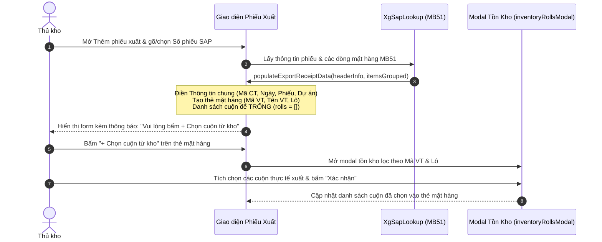

# Thiết Kế: Chọn Cuộn Thủ Công Khi Nhập Phiếu Xuất (Xà Gồ & Tole)

## 1. Mục tiêu & Bối cảnh
- **Hiện trạng**: Khi tạo phiếu xuất trong phân hệ Xà Gồ (`xg-xuat`) hoặc Tole (`tole-xuat`) bằng cách chọn số phiếu xuất từ SAP MB51 (hoặc đồng bộ Google Sheets), hàm `populateExportReceiptFromSap` tự động truy vấn toàn bộ các cuộn tồn kho trong bảng nhập tương ứng (`xg-nhap` / `tole-nhap`) và tự động chèn tất cả vào bảng cuộn của từng thẻ mặt hàng.
- **Vấn đề**: Việc tự động gán toàn bộ cuộn tồn kho vào phiếu khiến thủ kho không chủ động kiểm soát được những cuộn thực tế được lấy ra khỏi kho, dễ dẫn đến xuất sai cuộn hoặc số lượng vượt quá thực tế.
- **Yêu cầu mới**: Khi nhập phiếu xuất từ SAP, hệ thống chỉ tự động điền **Thông tin chung** và **Thông tin mặt hàng** (Mã VT, Tên VT, Lô/Batch). Mục danh sách cuộn xuất sẽ **để trống**, yêu cầu thủ kho tự bấm **`+ Chọn cuộn từ kho`** để chọn thủ công các cuộn mang đi xuất.

---

## 2. Phạm vi thay đổi

### 2.1. File `assets/js/xg/xg-xuat.js`
- Trong hàm `populateExportReceiptFromSap(headerInfo, itemsGrouped)`:
  - Loại bỏ hoàn toàn khối lệnh tự động truy vấn cuộn tồn kho từ `xg-nhap` (Bước 3).
  - Giữ danh sách `rolls: []` rỗng cho tất cả các mặt hàng được tạo từ phiếu SAP.
  - Cập nhật thông báo toast hiển thị: thông báo điền thông tin phiếu xuất thành công và hướng dẫn người dùng nhấn `+ Chọn cuộn từ kho`.
  - Giữ nguyên các cơ chế render thẻ mặt hàng (`renderItemCards()`), nút `+ Chọn cuộn từ kho` (`.btn-item-pick-inv`), và modal chọn tồn kho (`inventoryRollsModal`).

### 2.2. File `assets/js/tole/tole-xuat.js`
- Tương tự như trên đối với `populateExportReceiptFromSap(headerInfo, itemsGrouped)`:
  - Loại bỏ hoàn toàn khối lệnh tự động truy vấn cuộn tồn kho từ `tole-nhap` (Bước 3).
  - Giữ `rolls: []` rỗng cho từng thẻ mặt hàng.
  - Cập nhật thông báo toast tương ứng.

### 2.3. File `pages/xg/xg-xuat.html`
- Đổi nhãn nút `#btnEditAddRoll` trong `#editDataModal` (dòng 237) từ `+ Thêm cuộn` thành `+ Chọn cuộn từ kho` để nhất quán với `pages/tole/tole-xuat.html` và đúng bản chất hành động (mở modal chọn tồn kho).

### 2.4. Đồng bộ hóa phân phối (Build Sync)
- Chạy `node scripts/sync-dist.js` để tự động cập nhật các thay đổi từ `assets/` và `pages/` sang `dist/`, `dist-app/`, và `public/`.

---

## 3. Luồng hoạt động chi tiết (Flow)

---

## 4. Kế hoạch kiểm thử (Test Plan)
1. **Kiểm tra tạo phiếu xuất Xà Gồ (`xg-xuat`)**:
   - Mở modal thêm dữ liệu phiếu xuất.
   - Nhập hoặc chọn một số phiếu SAP MB51 hợp lệ.
   - Xác nhận: Thông tin chung và thẻ mặt hàng được điền đầy đủ; bảng cuộn xuất của mỗi mặt hàng hiển thị thông báo "Chưa có cuộn nào. Vui lòng bấm '+ Chọn cuộn từ kho'".
   - Bấm "+ Chọn cuộn từ kho": modal mở ra danh sách cuộn tồn kho đúng mã vật tư/lô, người dùng chọn các cuộn và số cuộn được thêm chính xác.
2. **Kiểm tra tạo phiếu xuất Tole (`tole-xuat`)**:
   - Thực hiện tương tự và kiểm tra kết quả bảng cuộn rỗng, người dùng bấm "+ Chọn cuộn từ kho" để chọn thủ công.
3. **Kiểm tra nút modal Sửa trong `xg-xuat.html`**:
   - Đảm bảo hiển thị nút `+ Chọn cuộn từ kho`.
4. **Kiểm thử hồi quy**:
   - Thao tác tính tổng khối lượng, đối chiếu SAP và lưu dữ liệu vẫn hoạt động chuẩn xác.
