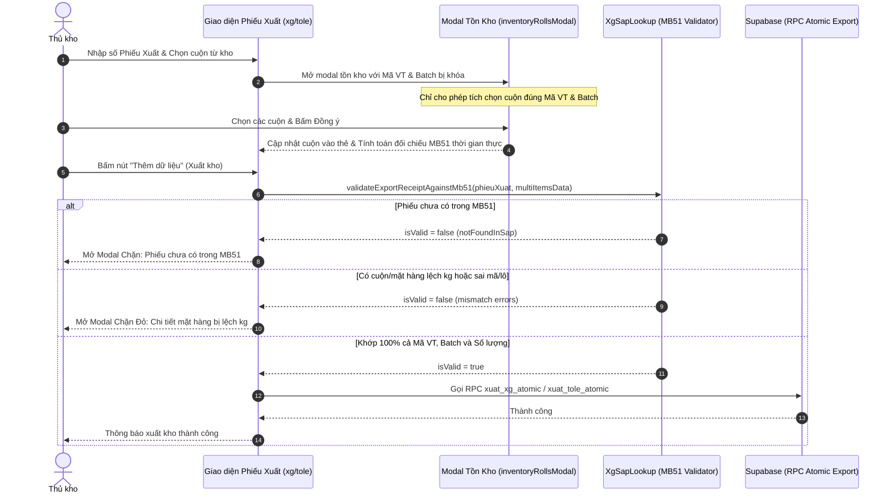

# Thiết Kế: Ngăn Chặn Xuất Kho Không Khớp Phiếu Xuất SAP MB51 (Xà Gồ & Tole)

- **Ngày tạo**: 2026-10-09
- **Trạng thái**: Đã phê duyệt
- **Phạm vi áp dụng**: `xg-xuat.html`, `tole-xuat.html`, `xg-sap-lookup.js`, `xg-xuat.js`, `tole-xuat.js`

---

## 1. Bối cảnh & Yêu cầu Nghiệp Vụ

### 1.1. Bối cảnh
Khi thủ kho thực hiện xuất kho tại phân hệ **Kho Xà Gồ** (`xg-xuat.html`) và **Kho Tole** (`tole-xuat.html`), phiếu xuất kho thực tế được quản lý và đối soát thông qua hệ thống SAP MB51 (bảng `xg_sap_mb51` trên Supabase).
Hiện tại:
- Khi thủ kho chọn cuộn từ tồn kho (`inventoryRollsModal`), hệ thống chưa kiểm tra xem cuộn được chọn có đúng Mã vật tư và Batch của phiếu xuất MB51 hay không.
- Khi gửi dữ liệu xuất kho (`addDataForm` / `editDataForm`), hệ thống chưa đối chiếu tổng số kg của các cuộn thực xuất với số lượng yêu cầu trên phiếu xuất MB51. Điều này dẫn đến nguy cơ xuất sai cuộn, xuất nhầm mặt hàng hoặc xuất lệch khối lượng so với lệnh xuất SAP MB51.

### 1.2. Mục tiêu Nghiệp Vụ
1. **Kiểm tra sự tồn tại trong MB51**: Bắt buộc số phiếu xuất phải tồn tại trong bảng `xg_sap_mb51` (với đúng phân hệ và chiều xuất `H` - Credit). Nếu không có trong MB51, chặn không cho phép xuất kho và hướng dẫn thủ kho đồng bộ Google Sheets.
2. **Ràng buộc đúng Mặt hàng & Lô (Batch)**: Các cuộn được chọn từ tồn kho phải thuộc đúng Mã vật tư và Lô được chỉ định trên phiếu xuất MB51. Không cho phép đưa cuộn sai mã hoặc sai lô vào thẻ mặt hàng.
3. **Kiểm tra khớp hoàn toàn 100% Khối lượng (Kg)**: Tổng số kg của các cuộn được chọn cho từng mặt hàng phải khớp chính xác 100% với số lượng trên dòng tương ứng của phiếu MB51 (chênh lệch tuyệt đối $< 0.05\text{ kg}$). Lệnh dư hoặc thiếu đều bị ngăn chặn hoàn toàn.
4. **Chỉ dẫn trực quan thời gian thực**: Hiển thị khối lượng yêu cầu MB51, khối lượng thực xuất và huy hiệu trạng thái (Khớp 100% / Lệch thiếu / Lệch dư) trên từng thẻ mặt hàng và tổng toàn bộ phiếu.

---

## 2. Thiết Kế Kiến Trúc & Chi Tiết Kỹ Thuật

### 2.1. Cấu Trúc Dữ Liệu MB51 Đối Chiếu
Mỗi phiếu xuất trong `xg_sap_mb51` có thể gồm một hoặc nhiều dòng mặt hàng:
- `material_document`: Số phiếu xuất (khớp với ô Phiếu xuất `col_3`).
- `material`: Mã vật tư.
- `material_description`: Tên vật tư.
- `batch`: Lô / Batch.
- `quantity`: Số lượng yêu cầu xuất (kg, giá trị tuyệt đối).

Trong form xuất kho, danh sách các thẻ mặt hàng (`multiItemsData`) lưu trữ:
```javascript
{
  id: string,
  maVatTu: string,
  tenVatTu: string,
  batch: string,
  sapKg: number, // Số lượng kg MB51 yêu cầu
  rolls: Array<{ id: string, cuonId: string, kg: string }> // Các cuộn thực chọn
}
```

---

### 2.2. Module Dùng Chung `xg-sap-lookup.js`

Xây dựng 2 hàm cốt lõi phục vụ kiểm tra và hiển thị cảnh báo:

#### a) `validateExportReceiptAgainstMb51(docNo, multiItemsData, pageContext)`
- **Đầu vào**:
  - `docNo`: Chuỗi số phiếu xuất.
  - `multiItemsData`: Mảng các mặt hàng cùng danh sách cuộn đã chọn.
  - `pageContext`: `'xg-xuat'` hoặc `'tole-xuat'`.
- **Luồng xử lý**:
  1. Nếu không có `docNo`: Trả về `{ isValid: false, message: 'Vui lòng nhập số phiếu xuất' }`.
  2. Truy vấn Supabase bảng `xg_sap_mb51` theo `material_document == docNo`.
  3. Lọc các dòng hợp lệ theo `pageContext` (`debit_credit_ind == 'H'` và nhóm vật tư thuộc Xà Gồ / Tole).
  4. Nếu không tìm thấy dòng hợp lệ nào:
     - Trả về `{ isValid: false, notFoundInSap: true, message: 'Số phiếu xuất chưa tồn tại trong dữ liệu SAP MB51' }`.
  5. Gom nhóm các dòng MB51 theo khóa `material__batch`:
     - `sapItemsMap.set(key, { material, description, batch, totalSapKg })`.
  6. Duyệt qua từng mặt hàng trong `multiItemsData`:
     - Kiểm tra nếu thẻ mặt hàng chưa có cuộn nào: Báo lỗi chưa chọn cuộn.
     - Kiểm tra cuộn bên trong: Nếu có cuộn sai `Mã vật tư` hoặc `Batch` so với MB51: Báo lỗi sai quy cách cuộn.
     - Tính tổng kg thực xuất: `actualKg = sum(roll.kg)`.
     - Tìm dòng SAP tương ứng theo `maVatTu__batch`:
       - Nếu không tìm thấy: Báo lỗi mặt hàng không thuộc phiếu MB51.
       - Nếu tìm thấy: Tính chênh lệch `diff = Math.round((actualKg - sapKg) * 100) / 100`.
       - Nếu $|diff| \ge 0.05\text{ kg}$: Đánh dấu mặt hàng chưa khớp.
  7. Trả về kết quả:
     ```javascript
     {
       isValid: boolean,
       docNo: string,
       notFoundInSap?: boolean,
       errors: Array<{
         itemIdx: number,
         maVatTu: string,
         tenVatTu: string,
         batch: string,
         sapKg: number,
         actualKg: number,
         diff: number,
         reason: string
       }>,
       sapSummary: { totalSapKg: number, totalActualKg: number, totalDiff: number }
     }
     ```

#### b) `showExportReceiptMismatchModal(validationResult, pageContext, onSyncCallback)`
- Hiển thị Modal Cảnh Báo Chặn Chuyên Dụng (Dark/Light mode hài hòa, icon cảnh báo đỏ, thiết kế đồng bộ với hệ thống):
  - **Trường hợp 1 (Chưa có trong MB51)**:
    - Tiêu đề: `KHÔNG CHO PHÉP XUẤT KHO!`
    - Nội dung: Thông báo số phiếu chưa có trong MB51, hướng dẫn bấm **"Đồng bộ Google Sheets"** hoặc kiểm tra lại số phiếu.
  - **Trường hợp 2 (Không khớp mặt hàng / Không khớp số kg)**:
    - Tiêu đề: `KHÔNG CHO PHÉP XUẤT KHO - DỮ LIỆU CHƯA KHỚP SAP MB51`
    - Bảng chi tiết đối chiếu từng mặt hàng:
      - Mã VT & Tên VT
      - Lô (Batch)
      - Khối lượng SAP MB51 yêu cầu
      - Khối lượng cuộn thực xuất
      - Chênh lệch (Lệch thiếu / Lệch dư với màu sắc tương ứng)
    - Nhấn mạnh quy định: *Bắt buộc phải khớp hoàn toàn 100% (lệch = 0 kg) mới được xuất kho.*

---

### 2.3. Cập Nhật Trong `xg-xuat.js` và `tole-xuat.js`

#### a) Ràng buộc tại Modal Chọn Cuộn (`inventoryRollsModal`)
- Khi mở modal từ thẻ mặt hàng `i`:
  - `openInventoryModal('add_item', item.maVatTu, item.batch, i)`:
  - Ghi nhận `lockedMaVatTu = item.maVatTu`, `lockedBatch = item.batch`.
- Trong `renderInventoryTable`:
  - Nếu `lockedMaVatTu` hoặc `lockedBatch` tồn tại:
    - Các cuộn có `Mã vật tư != lockedMaVatTu` hoặc `Batch != lockedBatch` sẽ bị **vô hiệu hóa checkbox** (`disabled = true`) và làm mờ dòng.
    - Cột trạng thái hiển thị huy hiệu: `<span class="badge bg-secondary">Không khớp mặt hàng</span>`.
- Trong `btnConfirmInventorySelection`:
  - Kiểm tra lần cuối toàn bộ cuộn được tick: Nếu có cuộn sai Mã VT hoặc Batch: Dừng và cảnh báo `alert('Cuộn không khớp với mặt hàng đang chọn trên phiếu MB51')`.

#### b) Giao diện đối chiếu trên Thẻ Mặt Hàng (`generateItemCardHTML` & `updateMultiItemTotals`)
- Bổ sung thanh đối chiếu SAP MB51 dưới danh sách cuộn của từng thẻ:
  ```html
  <div class="p-2 rounded border bg-light mb-2 d-flex justify-content-between align-items-center flex-wrap gap-2">
    <div>
      <span class="small text-muted me-2">Yêu cầu SAP MB51: <strong class="text-info">${formatNumericValue(item.sapKg)} kg</strong></span>
      <span class="small text-muted">Thực xuất: <strong class="text-primary">${formatNumericValue(totalItemKg)} kg</strong></span>
    </div>
    <div>
      ${reconciliationBadgeHTML}
    </div>
  </div>
  ```
- Cập nhật thống kê toàn phiếu (`globalTotals`):
  - Hiển thị: Tổng kg MB51 vs Tổng kg thực xuất.
  - Badge trạng thái toàn phiếu: `Khớp 100% toàn phiếu` (Xanh) hoặc `Chưa khớp hoàn toàn` (Đỏ).

#### c) Chặn tại sự kiện Submit Form (`addDataForm` & `editDataForm`)
- Trước khi thực hiện lệnh gọi RPC `xuat_xg_atomic` / `xuat_tole_atomic`:
  - Gọi `const checkResult = await window.XgSapLookup.validateExportReceiptAgainstMb51(phieuXuat, multiItemsData, pageContext);`
  - Nếu `!checkResult.isValid`:
    - Khôi phục trạng thái nút submit (`submitBtn.disabled = false`, trả lại text cũ).
    - Đóng overlay loading (`hideLoadingOverlay()`).
    - Gọi `window.XgSapLookup.showExportReceiptMismatchModal(checkResult, pageContext, syncCallback);`
    - **`return;`** (Không cho phép xuất).

---

## 3. Luồng Hoạt Động (Flow Diagram)



---

## 4. Kế Hoạch Kiểm Thử (Test Plan)

1. **Kiểm tra trường hợp Phiếu không có trong MB51**:
   - Nhập số phiếu giả định `PX_TEST_999999` (chưa có trong `xg_sap_mb51`).
   - Thêm cuộn và bấm "Thêm dữ liệu".
   - **Kỳ vọng**: Modal cảnh báo bật lên, thông báo phiếu chưa có trong MB51 và chặn không cho lưu.
2. **Kiểm tra trường hợp Chọn cuộn sai Mã VT hoặc Lô**:
   - Phiếu xuất MB51 yêu cầu Mã VT `A`, Batch `B`.
   - Vào modal tồn kho tìm cuộn có Mã VT `C` hoặc Batch `D`.
   - **Kỳ vọng**: Dòng cuộn đó bị disable checkbox hoặc khi chọn bị chặn thông báo không hợp lệ.
3. **Kiểm tra trường hợp Lệch số kg (Lệch thiếu & Lệch dư)**:
   - MB51 yêu cầu 5.000 kg.
   - Chọn các cuộn có tổng số kg là 4.200 kg (lệch thiếu) hoặc 5.500 kg (lệch dư).
   - Thẻ mặt hàng hiển thị badge cảnh báo lệch màu đỏ/vàng.
   - Bấm "Thêm dữ liệu".
   - **Kỳ vọng**: Modal cảnh báo đỏ hiển thị chi tiết số kg lệch và chặn không cho xuất.
4. **Kiểm tra trường hợp Khớp 100%**:
   - Chọn các cuộn sao cho tổng số kg khớp chính xác 100% với từng dòng MB51 (chênh lệch $< 0.05\text{ kg}$).
   - Huy hiệu đổi sang màu xanh "Khớp 100% (0 kg)".
   - Bấm "Thêm dữ liệu".
   - **Kỳ vọng**: Giao dịch RPC được thực thi, xuất kho thành công và cập nhật tồn kho.
5. **Kiểm tra hồi quy**:
   - Thử nghiệm trên cả `xg-xuat.html` và `tole-xuat.html`.
   - Thử nghiệm chức năng sửa cuộn trong `editDataModal`.
   - Chạy `node scripts/sync-dist.js` đồng bộ sang `dist/`, `dist-app/`, `public/`.
