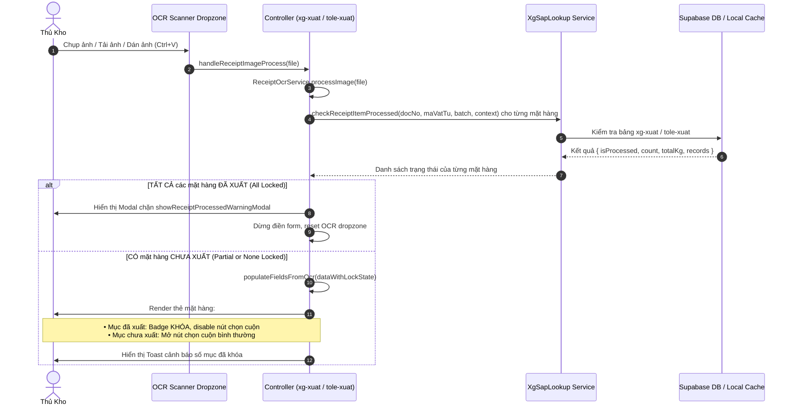

# Thiết Kế: Khóa Mặt Hàng Đã Xuất Khi Quét Phiếu Xuất Kho (XG-XUAT & TOLE-XUAT)

**Ngày tạo:** 09/10/2026  
**Phạm vi áp dụng:**
- `pages/xg/xg-xuat.html` & `assets/js/xg/xg-xuat.js`
- `pages/tole/tole-xuat.html` & `assets/js/tole/tole-xuat.js`
- Module dùng chung: `assets/js/xg/xg-sap-lookup.js`  
**Mục tiêu:** Khi thủ kho quét ảnh phiếu xuất kho (qua camera, upload hoặc dán ảnh clipboard), tự động đối soát từng mặt hàng trên phiếu với dữ liệu xuất kho đã lưu trên Supabase. Nếu phát hiện mặt hàng đã xuất thì hiển thị trạng thái khóa trực quan, vô hiệu hóa việc chọn cuộn cho mặt hàng đó; nếu tất cả các mặt hàng trong phiếu đều đã xuất thì chặn hoàn toàn để phòng ngừa xuất trùng lặp.

---

## 1. Bối Cảnh & Hiện Trạng

1. **Hiện trạng quét OCR Phiếu Xuất**:
   - Khi quét ảnh phiếu xuất qua OCR Dropzone (`handleReceiptImageProcess`):
     - Hệ thống phân loại kho (Xà Gồ / Tole) qua `ReceiptOcrService.classifyReceipt`.
     - Sau khi phân loại thành công, hệ thống gọi `populateFieldsFromOcr(result.data)` để điền các trường và tạo các thẻ mặt hàng (`multiItemsData`).
     - Tuy nhiên, hệ thống **chưa kiểm tra** xem số phiếu xuất này hoặc các mặt hàng trên phiếu đã từng được xuất trước đó trong bảng `xg-xuat` hay `tole-xuat` hay chưa.
   - Khi người dùng gửi form (`addDataForm`), hệ thống mới kiểm tra cấp số phiếu ở bước cuối cùng (`window.XgSapLookup.checkReceiptProcessed`). Lúc này nếu phiếu có nhiều mặt hàng và đã xuất một phần, người dùng không thể biết mặt hàng nào đã xuất và mặt hàng nào chưa xuất ngay tại thời điểm quét ảnh.

2. **Yêu cầu thực tế**:
   - Một phiếu xuất có thể chứa một hoặc nhiều mặt hàng (phân biệt theo `Mã vật tư` + `Batch`).
   - Khi quét ảnh:
     - Mặt hàng nào đã có dữ liệu xuất trong kho: Hiển thị biểu tượng/badge `🔒 ĐÃ XUẤT - KHÓA`, vô hiệu hóa nút `+ Chọn cuộn từ kho`.
     - Mặt hàng nào chưa xuất: Vẫn mở bình thường để thủ kho chọn cuộn từ tồn kho và xuất tiếp.
     - Nếu toàn bộ các mặt hàng đều đã xuất: Bật Modal chặn cảnh báo `showReceiptProcessedWarningModal` ngay lập tức.

---

## 2. Luồng Xử Lý Nghiệp Vụ (Workflow Diagram)



---

## 3. Thiết Kế Chi Tiết Kỹ Thuật

### 3.1. Cấu Trúc Dữ Liệu Thẻ Mặt Hàng (`multiItemsData`)

Mỗi mặt hàng trong `multiItemsData` được mở rộng thêm các thuộc tính quản lý trạng thái khóa:

```javascript
{
  id: "abc123xyz",
  maVatTu: "10001189",
  tenVatTu: "Thép phôi kẽm Z275 G450",
  batch: "1.8X351VN",
  sapKg: 5000,
  rolls: [],
  // Thuộc tính khóa mới
  isLocked: false,         // true nếu mặt hàng này đã được xuất kho trước đó
  lockInfo: {              // Dữ liệu đối soát nếu isLocked = true
    count: 3,              // Số cuộn đã xuất
    totalKg: 5020,         // Tổng kg đã xuất
    totalM: 0,             // Tổng mét đã xuất (đối với tole)
    lastDate: "2026-10-08",// Ngày xuất gần nhất
    coilIds: ["C01", "C02"]// Danh sách mã cuộn đã xuất
  }
}
```

---

### 3.2. Cập Nhật Hàm `handleReceiptImageProcess`

Tại `assets/js/xg/xg-xuat.js` và `assets/js/tole/tole-xuat.js`:

1. Sau khi hoàn thành phân loại kho (kho Xà Gồ vs Tole):
2. Trích xuất `docNo = (result.data.phieuXuat || '').trim()`.
3. Chuẩn hóa danh sách các mặt hàng từ OCR (`result.data.items` hoặc item đơn):
4. Nếu có `docNo`:
   - Duyệt qua từng mặt hàng, gọi song song:
     ```javascript
     const lockChecks = await Promise.all(items.map(async item => {
       if (!window.XgSapLookup || typeof window.XgSapLookup.checkReceiptItemProcessed !== 'function') {
         return { isProcessed: false };
       }
       return await window.XgSapLookup.checkReceiptItemProcessed(docNo, item.maVatTu, item.batch, CURRENT_PAGE_CONTEXT);
     }));
     ```
   - Gán `item.isLocked = Boolean(lockChecks[idx]?.isProcessed)` và `item.lockInfo = lockChecks[idx]`.
5. Đánh giá tổng thể phiếu:
   - Nếu `lockChecks.length > 0 && lockChecks.every(c => c.isProcessed)` (TẤT CẢ đều đã xuất):
     - Lấy tổng hợp thông tin từ `window.XgSapLookup.checkReceiptProcessed(docNo, CURRENT_PAGE_CONTEXT)`.
     - Gọi `window.XgSapLookup.showReceiptProcessedWarningModal({...})`.
     - Reset Dropzone, không điền vào form.
   - Nếu có ít nhất 1 mặt hàng chưa xuất:
     - Gọi `populateFieldsFromOcr(result.data)`.
     - Hiển thị preview ảnh và badge tóm tắt.
     - Hiển thị Toast thông báo:
       ```
       ⚠️ Phiếu xuất có ${lockedCount}/${totalCount} mặt hàng đã xuất kho (đã khóa). Vui lòng chọn cuộn cho ${unlockedCount} mặt hàng còn lại.
       ```

---

### 3.3. Cập Nhật Giao Diện Render Thẻ Mặt Hàng (`generateItemCardHTML` & `renderItemCards`)

1. **Giao diện thẻ bị khóa (`item.isLocked === true`)**:
   - **Header**:
     - Thêm badge đỏ:
       ```html
       <span class="badge bg-danger text-white border border-danger-subtle me-1" title="Mặt hàng này đã xuất trong kho">
         <i class="bi bi-shield-lock-fill me-1"></i>ĐÃ XUẤT (${lockKg} kg) - KHÓA
       </span>
       ```
     - Ẩn nút xóa thẻ hoặc hiển thị icon khóa nhỏ để người dùng không vô tình làm mất thông tin đối soát.
   - **Form Fields (Mã VT, Tên VT, Batch)**:
     - Gán thuộc tính `readonly` và style `background-color: #f1f5f9; cursor: not-allowed;`.
   - **Nút chọn cuộn**:
     - Vô hiệu hóa nút `+ Chọn cuộn từ kho`:
       ```html
       <button type="button" class="btn btn-sm btn-secondary py-1 px-2" disabled title="Mặt hàng này đã xuất kho, không thể chọn cuộn thêm">
         <i class="bi bi-lock-fill me-1"></i>Đã khóa mục
       </button>
       ```
   - **Bảng danh sách cuộn của thẻ**:
     - Hiển thị thông báo giải thích:
       ```html
       <tr>
         <td colspan="4" class="text-center text-danger py-2" style="font-size: 0.8rem; background: #fff5f5;">
           <i class="bi bi-info-circle-fill me-1"></i>
           Mặt hàng này đã xuất kho trước đó (${lockKg} kg, ${lockCount} cuộn). Hệ thống khóa mục này để tránh xuất trùng.
         </td>
       </tr>
       ```
   - **Styling tổng thể của thẻ**:
     - Card container được gắn class `.item-card-locked` với viền `border: 1px dashed rgba(239, 68, 68, 0.45); background: #fafafa;`.

2. **Giao diện thẻ chưa xuất (`item.isLocked === false`)**:
   - Giữ nguyên các thao tác chọn cuộn, chỉnh sửa và đối soát với SAP MB51 như hiện tại.

---

### 3.4. Chốt Chặn Khi Submit Form (`addDataForm`)

1. Khi người dùng nhấn nút "Thêm dữ liệu":
   - Bỏ qua các thẻ mặt hàng có `item.isLocked === true`.
   - Chỉ thu thập các cuộn từ những thẻ mặt hàng chưa khóa (`!item.isLocked`).
   - Nếu `recordsToInsert.length === 0`:
     - Nếu có thẻ bị khóa: Hiển thị cảnh báo: *"Tất cả mặt hàng trong phiếu đã xuất trước đó hoặc bạn chưa chọn cuộn cho mặt hàng mới."*
     - Ngăn chặn việc gửi request lên Supabase.
2. Kiểm tra an toàn:
   - Nếu người dùng sửa số phiếu tay trên ô input sau khi quét, hàm `change` trên ô phiếu xuất sẽ tự động kích hoạt kiểm tra lại và làm mới trạng thái khóa của các thẻ.

---

## 4. Kế Hoạch Kiểm Thử & Đồng Bộ Hóa

### 4.1. Kịch Bản Kiểm Thử (Test Cases)

1. **Test Case 1: Quét phiếu xuất mới hoàn toàn (Chưa từng xuất)**:
   - Quét ảnh phiếu xuất kho hợp lệ.
   - Kết quả: Tất cả các thẻ mặt hàng đều ở trạng thái mở bình thường (`isLocked: false`), nút `+ Chọn cuộn từ kho` hoạt động tốt.

2. **Test Case 2: Quét phiếu xuất đã xuất 100% (Tất cả mặt hàng đã xuất)**:
   - Quét ảnh phiếu có số phiếu đã tồn tại trong CSDL `xg-xuat` hoặc `tole-xuat`.
   - Kết quả: Bật Modal cảnh báo chặn `showReceiptProcessedWarningModal` ngay sau khi quét; form không bị điền trùng lặp.

3. **Test Case 3: Quét phiếu xuất có 2 mặt hàng (1 mặt hàng đã xuất, 1 mặt hàng chưa xuất)**:
   - Mặt hàng 1 (đã xuất): Thẻ có badge `🔒 ĐÃ XUẤT - KHÓA`, nút chọn cuộn bị disabled, các ô nhập readonly.
   - Mặt hàng 2 (chưa xuất): Thẻ mở bình thường, bấm được `+ Chọn cuộn từ kho`.
   - Submit: Chỉ lưu các cuộn của mặt hàng 2 vào CSDL, không ghi đè mặt hàng 1.

### 4.2. Đồng Bộ Hóa Build
Sau khi cập nhật code tại `assets/js/xg/xg-xuat.js`, `assets/js/tole/tole-xuat.js` và `assets/js/xg/xg-sap-lookup.js`:
- Chạy lệnh build: `npm run build` (`node scripts/sync-dist.js`) để đồng bộ toàn bộ file sang `dist/`, `dist-app/` và `public/`.
